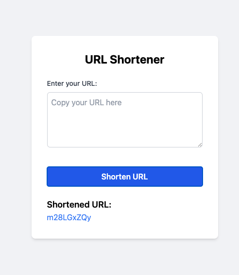
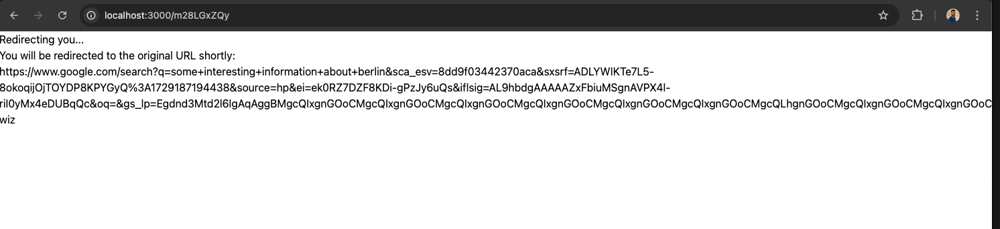
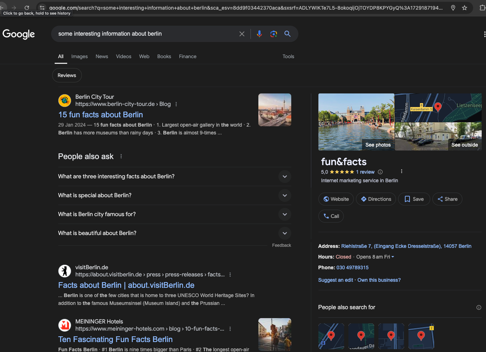

# URL Shortener Web Application 

This is a simple URL shortener web application built with **React.js** on the frontend, integrated with a URL shortening backend service. The application allows users to input a URL and generate a shortened Identifier, which can be used to redirect to the original URL. This project demonstrates frontend development with React, TailwindCSS for styling, and axios for HTTP requests.

## Features

- Shorten URLs.
- Display the shortened URL(Identifier).
- Click on the shortened URL to be redirected.
- Handles errors and shows appropriate error messages.
- Clean UI with TailwindCSS styling 

## Project Structure

```bash
├── public
├── src
│   ├── pages
│   │   └── ErrorPage.jsx
│   │   └── HomePage.jsx    
│   │   └── RedirectPage.jsx        
│   ├── services
│   │   └── urlService.js       
│   └── App.js                  
├── README.md
└── package.json
```
 - HomePage: The main page where users can input their URLs, and Displays the shortened URL once the request is successful
 - RedirectPage: redirect to the original URL.
 - urlService: Handles API requests using axios to interact with the backend URL shortening service.

## Technologies & Packages

The following packages and technologies were used in the project:

 - React: A JavaScript library for building user interfaces.
 - TailwindCSS: A utility-first CSS framework for styling the application.
 - axios: Promise-based HTTP client for making API requests.

## Installation & Setup

 # Prerequisites

  - Make sure you have Node.js and npm installed.

 # Installed Packages
  - React Router DOM: npm install react-router-dom
  - axios: npm install axios
  - Tailwind CSS: npm install -D tailwindcss postcss autoprefixer
  - Tailwind Configuration: npx tailwindcss init -p

  In tailwind.config.js, make sure to include the src folder paths:
  ```
    module.exports = {
     content: [
            "./src/**/*.{js,jsx,ts,tsx}",
        ],
     theme: {
         extend: {},
        },
     plugins: [],
    };
  ```
 In your main CSS file (src/index.css), add the following lines to include Tailwind
    @tailwind base;
    @tailwind components;
    @tailwind utilities;

## Running the Application

To run the React app locally, use the following command:

 `npm start`

This will start the development server, and the application will be accessible at http://localhost:3000 .

## Backend Integration

Ensure that the backend URL shortening service is up and running, as this React app interacts with the backend API to shorten URLs.

## Usage

 - Open the application at http://localhost:3000.
 - Enter a URL into the input field.
 - Click Shorten URL.
 - The shortened URL will be displayed. Clicking on it will redirect you to the original URL.

## Example Workflow
 1. **Step 1: Enter a URL into the input field**

 

2. **Step 2: Shorten URL by clicking the "Shorten URL" button**
 
 

3. **Step 3: Click on the shortened URL to be redirected to the original URL**

 

 

## Note
TO make The browser should redirect you to the original URL while keeping the http://localhost:3000/shortenedUrl route in the address bar, so one of the Solutions is hosting the app on a platform like Netlify,create a proxy server that resolves the original URL and serves it, allowing you to maintain the same route in the address bar. 
